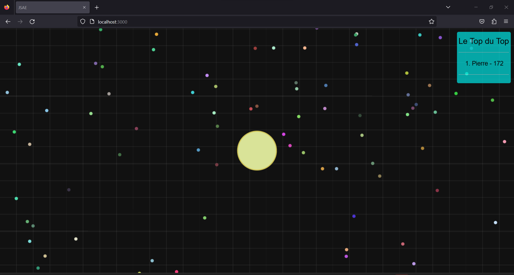

# AGARGRRRRRBAWFLEX.IO
# Nom 
* Noé Decobecq 
* Pierre Goujet
* Théo Franos 
* Groupe : S4-H




# Dépendances
* NodeJS
* ExpressJS
* Socket.io
* BootStrap
* JQuery

# Instructions
1. Faire un git clone de ce répertoire
2. ```cd``` dans ce fichier puis faire ```npm i```
3. Faire la commande```node index.js```
4. Allez sur localhost:3000 pour jouer.
5. Pour voir le multijoueur, il suffit d'ouvrir un autre onglet de votre navigateur et d'aller sur la même adresse. 


La taille de la carte est modifiable assez facilement. Vous pouvez éditer ceci dans le fichier ```socketMain.js``` contenu dans le fichier  ```sockets```. En haut de se fichier, il y a ```settings``` qui permet de modifier les paramètres de votre jeu de base:

``` 
let settings = {
  defaultOrbs: 50,
  defaultSpeed: 5,
  defaultSize: 6,
  defaultZoom: 1.5,
  worldWidth: 500,
  worldHeight: 500
}
```
Ce sont les meilleures paramètres pour tester notre projet avec le multijoueur.
Changez ```worldWidth``` et ```worldHeight``` (5000 x 5000 par exemple ) pour une plus grande carte.

# Explication des classes

1. Orbs --> La nourriture
2. PlayerConfig --> Stocke les données que les autres joueurs n'ont pas besoins de savoir
3. PlayerData --> Stocke les données qu'on doit transmettre aux autres joueurs
4. Player --> Contient un socketid , un PlayerConfig et un PlayerData
5. checkCollisions --> Fonctions qui retourne s'il y a une collision entre une nourriture et un joueur ou entre joueur. Elle update aussi le leaderboard.
6. socketMain --> classe principale qui initialise la partie, qui gère les déplacements des joueurs, qui gère les connexions des joueurs.
7. socketStuff --> classe qui reçoit les ```emit``` de socketMain. Elle renvoie un message à l'écran quand un joueur mange un autre par exemple.
8. canvasStuff --> Là où tout est dessiner sur le canvas et calcul le déplacement des joueurs.
9. servers --> crée le serveur.
10. expressMain --> renvoie que l'application Express de servers.
11. index --> permet de lancer le jeu en connectant l'app Express et socketMain.

# Difficultés

1. Faire en sorte que le joueur reste au centre de l'écran --> nous sommes passés par la doc et nous avons trouvé la fonction ``` translate ```

2. Faire le lien entre le serveur et le joueur et inclure le multijoueur --> Se renseigner grâce à des vidéos, bien répartir les fonctions par rapport à ce quelles font. Les vidéos sur les ```socket.emit``` nous ont grandement aidés à comprendre comment cela marché.

3. Installation du WebPack et de Babel --> Pas encore résolu

4. Les collisons entre joueurs et nourriture --> On voulait utiliser la bibliothèque p5js qui permetait de gérer tout les mouvements, le calcul des distance... Mais on a utilisé des fonctions de maths pour claire pour nous, pas optimal mais claire.

# Améliorations

1. Mettre une page rejouer
2. Mettre une meilleure KillCam
3. Mettre plus d'infos sur le leaderBoard
4. Voir le jeu en arrière plan au formulaire de connexion.
5. Mettre des skins et pouvoir choisir son skin.